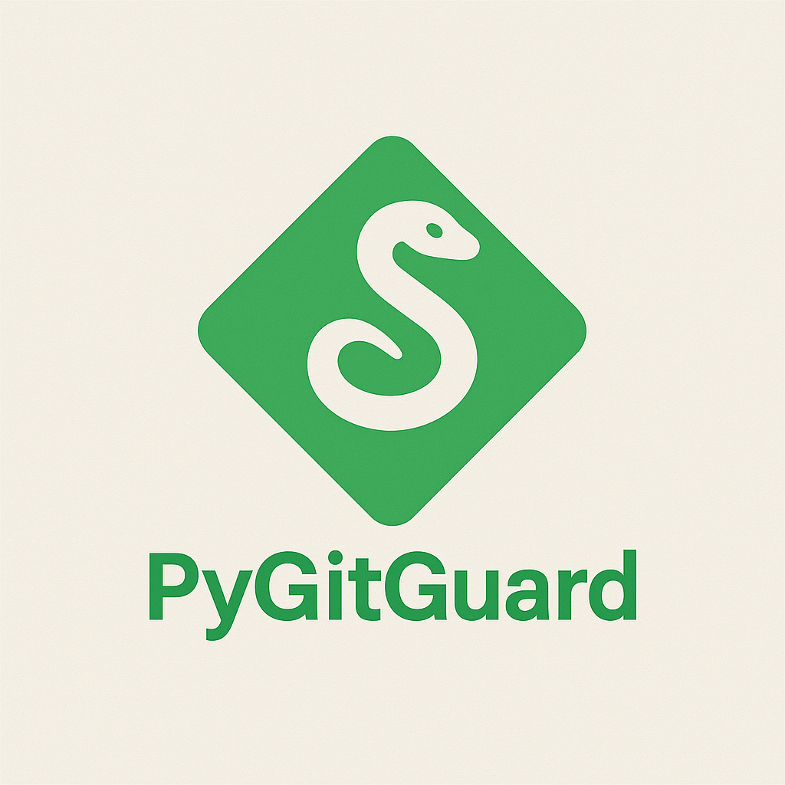
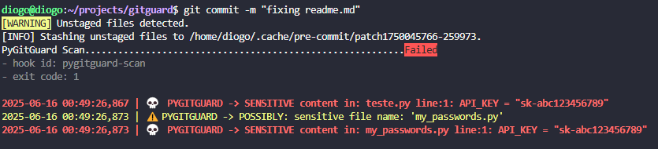

<p align="center">
  
</p>

# 🛡️ PyGitGuard

**PyGitGuard** is a Git security scanner designed to prevent accidental commits of sensitive data by scanning for:

* 🧪 Exposed credentials
* 📁 Potentially sensitive files
* 📄 Missing best practice files

---

## 📦 Version History

**1.0.1** 
  - Fix: pip install support.
  - Fix: pre-commit support.
  - Fix: Improvements to config in .pre-commit-config.yaml.
  - Fix: Add pre-commit to requirements.txt.
  - Fix: Creating config files if they do not exist.
  - Fix: Remove interactive mode with input (not supported with pre-commit).
**1.0.0** – Initial release with core features

### ✅ Features

* 🚫 Detect sensitive content via regex (e.g., passwords, tokens, API keys)
* 🔍 Scan for sensitive filenames like `.env`, `.pem`, `id_rsa`
* 📏 Enforce maximum file size policies
* 📚 Recommend best practice files (e.g., `README.md`, `.gitignore`, `LICENSE`)
* 🔄 Auto-generate configuration files
* 🪝 Pre-commit hook support

---

## 🚀 Quick Start Guide

### 1. Install PyGitGuard

```bash
pip install git+https://github.com/digo5ds/pygitguard.git
```

### 2. Install and Configure `pre-commit`

If you haven't already:

```bash
pip install pre-commit
pre-commit install
```

To manually run a scan:

```bash
pygitguard
```

To scan a specific path:

```bash
pygitguard --path <your_repository>
```

> With pre-commit configured, the scan runs automatically before each commit.

<p align="center">
  
</p>

To bypass a scan for a commit:

```bash
git commit -m "your message" --no-verify
```

---

## ⚙️ Configuration

On the first run, `.pygitguard.yaml` and `.pre-commit-config.yaml` is created (if not exists). This file allows customization of scan behavior.
## 📌 Using with `.pre-commit-config.yaml`

If you're already using pre-commit, add this to your config:

```yaml
repos:
  - repo: https://github.com/digo5ds/pygitguard
    rev: 1.0.1  # Replace with the latest release
    hooks:
      - id: pygitguard-scan
        name: PyGitGuard Scan
        entry: pygitguard
        language: system
        types: [python]
        stages: [pre-commit]
```

### Example `.pygitguard.yaml`

```yaml
SENSITIVE_PATTERNS:
  - .*\.env.*$
  - .*\.pem.*$
  - .*\.key.*$
  - .*\.crt.*$
  - .*\.sqlite.*$
  - .*\.db.*$
  - .*secret.*$
  - .*credential.*$
  - .*id_rsa.*$
  - .*password.*$
  - .*token.*$
  - .*ACCESS_KEY.*$

SENSITIVE_CONTENT:
  - \b\w*password\w*\s*=\s*['"`].+['"`]
  - \b\w*token\w*\s*=\s*['"`].+['"`]
  - \b\w*api[_-]?key\w*\s*=\s*['"`].+['"`]
  - \b\w*user(name)?\w*\s*=\s*['"`].+['"`]
  - \b\w*ACCESS_KEY\w*\s*=\s*['"`].+['"`]

BEST_PRACTICES_FILES:
  - .gitignore
  - README.md
  - LICENSE
  - requirements.txt
  - pyproject.toml
  - Dockerfile: .dockerignore
  - docker-compose.yml: .dockerignore
  - __version__.py  # Recommended

MAX_FILE_SIZE_MB: 1
```

---

## 💡 Tips

* Add `__version__.py` to `BEST_PRACTICES_FILES` to track versioning.
* Customize `MAX_FILE_SIZE_MB` for your project's sensitivity.

---

## 🔧 Local Hook Example

To use as a local hook:

```yaml
- repo: local
  hooks:
    - id: pygitguard
      name: pygitguard
      entry: pygitguard_cli
      language: system
      types: [python]
```

---

## 📄 License

MIT License

---

## 🤝 Contributing

Pull requests and issue reports are welcome!

### 📬 Contact

[LinkedIn](https://www.linkedin.com/in/diogosilvaf/)
